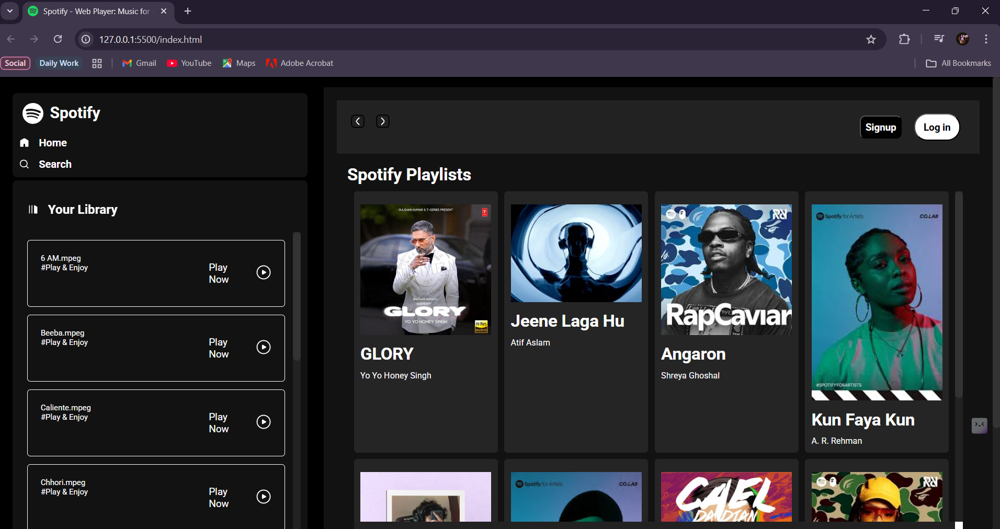
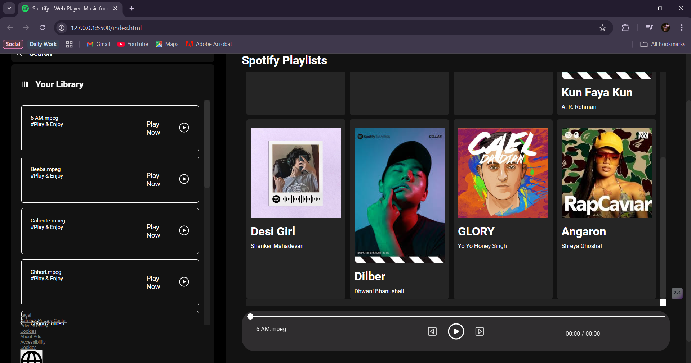

# 🎵 Spotify Clone – A Music Player Web App

A simple and elegant **Spotify-inspired Music Player Web App** built using **HTML, CSS, and JavaScript**.  
This project plays songs, displays a song list, and provides basic audio controls in a responsive layout.

---

## 🎯 Features

- 🎧 Play/pause functionality
- ⏩ Next and previous song navigation
- 🧭 Seek bar with real-time progress
- 📃 Dynamic song list with clickable items
- 💡 Responsive design

---

## 📸 Preview   

  
  

---

  

---

## 🛠️ Tech Stack

- **HTML5** – Structure and content  
- **CSS3** – Styling and layout  
- **JavaScript** – Interactive behavior and audio handling

---
